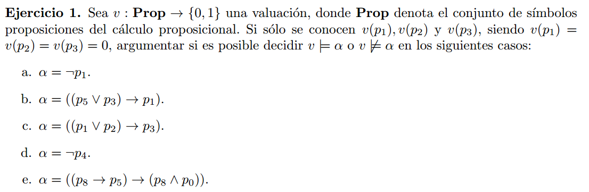

## i
Probar que si α ∧ β es una contingencia, entonces α es contingencia o β es contingencia

Si $\alpha \wedge \beta$ es contingencia, entonces existe $v1$ y $v2$ tal que:

$$v1 \vDash \alpha \wedge \beta$$
$$v2 \nvDash \alpha \wedge \beta$$

Sabemos que :

$$v1 \vDash \alpha \wedge \beta \Leftrightarrow  v1 \vDash \alpha \text{ y } v1 \vDash \beta$$ 
$$v2 \nvDash \alpha \wedge \beta \Leftrightarrow  v2 \nvDash \alpha \text{ o } v2 \nvDash \beta$$ 

Juntando todo esto, formamos las siguientes combinaciones con v1 y v2:

1. $v1 \vDash \alpha$, $v2 \nvDash \alpha$, $v1 \vDash \beta$, $v2 \nvDash \beta$ ()
1. $v1 \vDash \alpha$, $v2 \vDash \alpha$, $v1 \vDash \beta$, $v2 \nvDash \beta$
1. $v1 \vDash \alpha$, $v2 \nvDash \alpha$, $v1 \vDash \beta$, $v2 \nvDash \beta$

Vemos que en todos los casos $\alpha$ y $\beta$ son contingencias, ya que con una valuacion valen y con la otra no.

## ii

$\begin{aligned}&\text{b. Dadas dos valuaciones }v,v^{\prime},\text{ probar que si }v(p_{i})=v^{\prime}(p_{i})\text{ para toda }p_{i}\in\mathbf{Var}(\alpha)\text{ entonces}\\&v\models\alpha\text{ si y sólo si }v^{\prime}\models\alpha.\end{aligned}$

($\Rightarrow$) 
$$v(p_{i})=v^{\prime}(p_{i}) \Rightarrow  (v\models\alpha\ \Rightarrow v^{\prime}\models\alpha)$$

Usemos induccion estructural:

``Caso base``:  $\alpha = p$
$$v(p)=v^{\prime}(p) \Rightarrow  (v\models p\ \Rightarrow v^{\prime}\models p)$$

$$v\models p \Leftrightarrow v(p) = 1 \Leftrightarrow v(p') = 1 \Leftrightarrow v'\models p $$

``Caso inductivo``:  
HI : $v(p_{i})=v^{\prime}(p_{i}) \Rightarrow  (v\models\beta\ \Rightarrow v^{\prime}\models\beta)$

Caso: $\alpha = \neg\beta$

Quiero ver que:  
$v(p_{i})=v^{\prime}(p_{i}) \Rightarrow  (v\models\neg\beta\ \Rightarrow v^{\prime}\models\neg\beta)$

$$ v\models\neg\beta \Leftrightarrow v \nvDash \beta  $$

