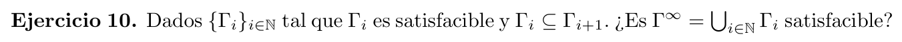

$\Gamma ^ \infty$ es satisfacible.

Vamos a usar el siguiente lema:  
Para todo $\Delta \subseteq \Gamma_k$ existe un $\Gamma_k$ lo suficientemente grande tal que $\Delta \subseteq \Gamma_k$  
Esto es evidente por la forma de $\Gamma ^ \infty$ y las propiedades de todos los $\Gamma_i$ .

Veamos que cualquier $\Delta \subseteq \Gamma ^ \infty$ es satisfacible. 
Por el lema, podemos asegurar que existe un $\Gamma_k$ tal que $\Delta \subseteq \Gamma_k$. 
Como $\Gamma_k$ es satisfacible, $\Delta$ debe ser satisfacible. 
Por compacidad, si todo $\Delta \subseteq \Gamma ^ \infty$ es satisfacible, entonces $\Gamma ^ \infty$ es satisfacible.