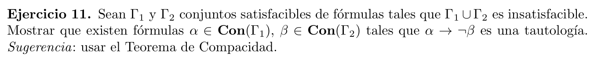
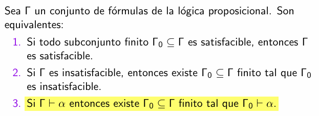

  

Recordemos lo que nos dice el teorema de compacidad:

  

Por compacidad, existe un conjunto insatisfacible $\Gamma_0 \subseteq \Gamma_1 \cup \Gamma_2$. 
Sea $\Gamma_0 = \Alpha \sqcup \Beta$, donde $\sqcup$ representa la union disjunta y $\Alpha \subseteq \Gamma_1$ y $\Beta \subseteq \Gamma_2$.  
Por insatisfacibilidad, no existe una valuacion que haga valer al mismo tiempo todos las formulas de $\Gamma_0$, en particular existen $\alpha \in \Alpha$ y $\beta \in \Beta$ que no pueden valer a la vez $(\nvDash \alpha \wedge \beta)$.  
Notemos que $\alpha$ y $\beta$ no pueden estar a la vez en $\Alpha$ o en $\Beta$, ya que esto implicaria insatisfacibilidad en $\Gamma_1$ o $\Gamma_2$.  
Tenemos que $\alpha \wedge \beta$ es contradiccion, esto implica que $\neg(\alpha \wedge \beta)$ es tautologia.
$$\neg(\alpha \wedge \beta) = \neg \alpha \lor \neg \beta = \alpha \rarr \neg\beta $$

Por lo tanto $\alpha \rarr \neg\beta$ es tautologia. Ademas:

- $\alpha \in \Alpha \subseteq \Gamma_1 \Rightarrow \alpha \in \Gamma_1$
- $\beta \in \Beta  \subseteq \Gamma_2 \Rightarrow \beta \in \Gamma_2$

$$
% \textcolor{blue}{a} + \textcolor{green}{b} = \textcolor{red}{c}
$$