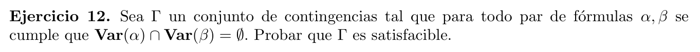

  

Por el enunciado, podemos deducir que no existe un par de formulas  $\alpha , \beta \in \Gamma$ que compartan alguna variable proposicional.  

Sea $\Gamma = \{\alpha_1 , \ldots , \alpha_n\}$ y dadas las valuaciones $v_1 , \ldots , v_n$ tal que $v_i \vDash \alpha_i$, (podemos asegurar que cada $v_i$ existe, ya que cada $\alpha_i$ es una contingenca).  
Dada la siguiente valuacion:

$$v(p)=\begin{cases}v_1(p)&si&p\in Var(\alpha_1)\\
\vdots \\
v_n(p)&si&p\in Var(\alpha_n)\\
0&c.c\end{cases}$$

Notemos que esta valuacion esta bien definida porque por lo que dijimos al principio, una variable proposicional $p$ puede estar como mucho en el conjunto $Var$ de un solo $\alpha_k$ a la vez.
 
Es evidente que $v \vDash \alpha_i$ para todo $i : 0 ,\ldots, n$. Lo cual implica que $v \vDash \Gamma$, luego $\Gamma$ es satisfacible.

