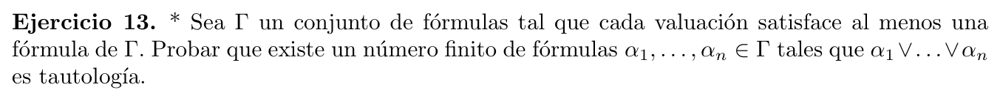

  

Definamos el conjunto $\Gamma ' = \{\neg\alpha :\alpha \in \Gamma\}$  

Notemos que este conjunto es insatisfacible, ya que para cualquier valuacion
$v$ se cumple que $v \vDash \alpha_i$ para algun $\alpha_i \in \Gamma$, lo que implica que
$v \nvDash \neg\alpha_i$, para algun $\neg\alpha_i \in \Gamma ' $ por la 
caracterizacion de $\Gamma '$.

Por compacidad, existe un conjunto finito e insatisfacible 
$\Gamma'_0 \subseteq \Gamma'$. Si $\Gamma'_0 = \{\neg\alpha_1, \ldots, \neg\alpha_n\}$
, entonces vale que  :
 $$\nvDash \neg\alpha_1 \wedge \ldots \wedge \neg\alpha_n$$ 
 
Lo que equivale que:

$$\vDash \neg(\neg\alpha_1 \wedge \ldots \wedge \neg\alpha_n)$$

Por De Morgan, esto es equivale a:

$$\vDash (\neg\neg\alpha_1 \lor \ldots \lor \neg\neg\alpha_n)$$

Eliminando la doble negacion (se puede verificar con tabla de verdad)

$$\vDash (\alpha_1 \lor \ldots \lor \alpha_n) \text{ , con cada } \alpha_i \in \Gamma$$

