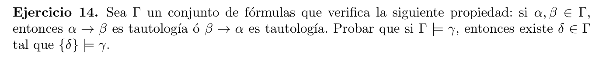

  

## Lema auxiliar:  
Para todo $i$ vale que:  
Dado $\Delta \subseteq \Gamma$, tal que $\# \Delta = i$, existe $\delta \in \Delta$ tal que $\{\delta\} \vDash \Delta \ $  
($\delta$ fuerza a todas las formulas de $\Delta$).

## Demo del lema
Usamos induccion:

### Caso Base (i = 1):
Si $\#\Delta = 1$, entonces $\Delta = \{\delta\}$, entonces vale que $\{\delta\} \vDash \Delta$.

### Paso inductivo

### HI:
Para todo $\Delta \subseteq \Gamma$, tal que $\# \Delta = n$, existe $\delta \in \Delta$ tal que $\{\delta\} \vDash \Delta \ $  
($\delta$ fuerza a todas las formulas de $\Delta$).

### Quiero ver que:
Para todo $\Delta \subseteq \Gamma$, tal que $\# \Delta = n+1$, existe $\delta \in \Delta$ tal que $\{\delta\} \vDash \Delta \ $  
($\delta$ fuerza a todas las formulas de $\Delta$).

Cualquier $\Delta \subseteq \Gamma$ de cardinal $n+1$, se puede formar de la siguiente forma: 
$$\Delta = \Delta' \cup \{\sigma\}$$
Con $\Delta' \subseteq \Gamma$ de cardinal $n$ y $\sigma \in \Gamma \backslash \Delta'$.

Por HI, sabemos que hay un $\delta_0 \in \Delta'$ tal que $\delta_0 \vDash \Delta'$.  
Por enunciado deducimos que, o bien $(\sigma \rarr \delta_0)$ es tautologia, o bien $(\delta_0 \rarr \sigma)$ lo es.

### Caso $(\delta_0 \rarr \sigma)$ es tautologia:
Ya esta, $\delta_0$ es la formula que buscamos. $\{ \delta_0 \} \vDash \Delta$, ya que $\{\delta_0\} \vDash \Delta'$ y $\{ \delta_0 \} \vDash \sigma$

### Caso $(\sigma \rarr \delta_0)$ es tautologia:
Ya esta, $\sigma$ es la formula que buscamos. $\{ \sigma \} \vDash \Delta$, ya que $\{\sigma\} \vDash \sigma$ y $\{ \sigma \} \vDash \Delta'$.  
Esto ultimo se es porque $\Delta \subseteq Con(\{\delta_0\}) \subseteq Con(\{\sigma\})$
(ver ej 12.a practica 4).  
Ya que $\Delta' \subseteq Con(\{\sigma\})$, entonces $\{ \sigma \} \vDash \Delta'$.

## Consecuencia del lema auxiliar
Si tomamos $\Delta = \Gamma$, entonces vale que:  
Existe $\delta \in \Gamma$, tal que $\{\delta\} \vDash \Gamma$.  

De aca en adelante, cada vez que escriba $\delta$ me estoy refiriendo a este 
$\delta$ en particular.

## Demo principal

Sea $\gamma$ una formula tal que $\Gamma \vDash \gamma$, esto es equivalente a $\Gamma \vdash \gamma$.  
Sea $\alpha_1 , \ldots , (\alpha_n = \gamma)$ una deduccion de $\gamma$ a partir de $\Gamma$, existe 
$\beta_1 , \ldots ,(\beta_m = \alpha)$ una deduccion de $\alpha$ a partir de $\{\delta\}$, con $\delta \in \Gamma$, tal que $\{\delta\} \vDash \Gamma$. Luego $\{\delta\} \vdash \gamma$, y equivalentemente $\{\delta\} \vDash \gamma$.

Probemos lo que dijimos por induccion:

$P(n) = $ si $\alpha_1 , \ldots , \alpha_n = \gamma$ es una derivacion de $\gamma$ a partir de $\Gamma$,
entonces podemos entontrar una derivacion de $\gamma$ a partir de $\{\delta\}$ con $\delta \in \Gamma$, tal que $\{\delta\} \vDash \Gamma$. 

<!-- $\{\delta\} \vDash \gamma$, con $\delta \in \Gamma$, tal que $\{\delta\} \vDash \Gamma$. -->

### Caso Base P(1):
La derivacion es $\alpha_1 = \gamma$.
- Si $\alpha_1$ es axioma, entonces se puede deducir de $\{\delta\}$ en un solo paso.
- Si $\alpha_1 \in \Gamma$, por la consecuencia del lema auxiliar, vale que $\{\delta\} \vDash \Gamma$, equivalentemente,  $\{\delta\} \vdash \Gamma$, en particular $\{\delta\} \vdash \alpha_1$. Por lo tanto, se cumple lo que queria.

### Paso inductivo 
Supongo que vale $P(k)$ para todo $k<n$ (HI). Quiero ver que vale $P(n+1)$.  

Sea $\alpha_1 , \ldots , \alpha_n ,(\alpha_{n+1} = \gamma)$ una deduccion de $\gamma$ a partir de $\Gamma$. Tenemos 3 casos posibles.

### Caso $\alpha_{n+1}$ es axioma:
Igual al del caso base...

### Caso $\alpha_{n+1}$ $\in \Gamma$:
Igual al del caso base...

### Caso $\alpha_{n+1}$ era consecuencia inmediata de $\alpha_i$ y $\alpha_j = \alpha_i \rarr \gamma$ :

Tomo la deduccion que teniamos de $\alpha$ y la modifico de la siguiente forma:

- Cada $\alpha_i$ con $1 \leq i \leq n$ lo reemplazo por su deduccion $\beta_1^{(i)} , \ldots , \beta_{m_i}^{(i)} = \alpha_i$ a parir de $\{\delta\}$, lo cual se que puedo hacer por HI.
Con este cambio la deduccion nos queda:  

$$ (\beta_1^{(1)} , \ldots , \beta_{m_1}^{(1)} = \alpha_1), \ldots , (\beta_1^{(n)} , \ldots , \beta_{m_n}^{(n)} = \alpha_n) , \alpha_{n+1} = \gamma$$

Ahora $\alpha_{n+1}$ es consecuencia directa de $\beta_{m_i}^{(i)}$ y $\beta_{m_j}^{(j)}$. Y la deduccion de $\gamma$ que nos queda es a partir de $\{\delta\}$.

