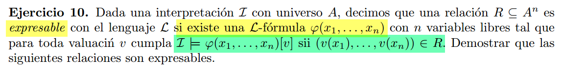
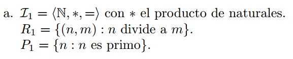
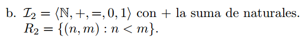
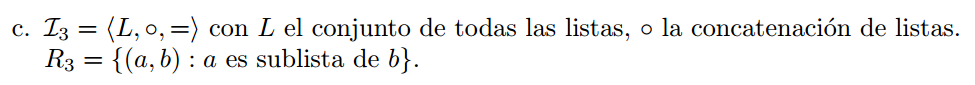

## a)
  

$\varphi_{R_1}(x,y) = x \neq 0 \land (\exists k)(y = k * x)$

$\varphi_{P_1}(x) = \neg \varphi_1(x) \land (\forall d)(R_{1 \mathcal{I}}(d,x) \rarr (\varphi_1(x) \lor d = x ))$

Donde $\varphi_1(x)$ es la formula que distingue al 1, la cual definimos en ejercicios anteriores.

## b)

$\varphi_{R_2}(x,y) = (\exists z)(z \neq 0 \land  x + z = y)$

## c)

Asumo que las sub-listas deben tener todos los elemenos de la lista grande contiguos.

$\varphi_{R_3}(x,y) = (\exists z)(\exists w)(z \circ x \circ w = y)$

