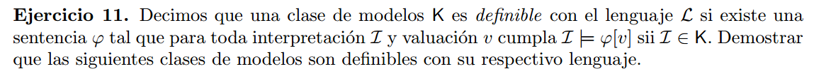
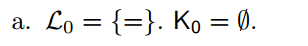
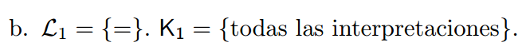
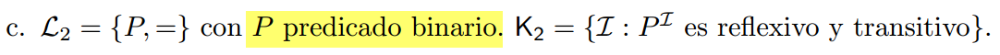
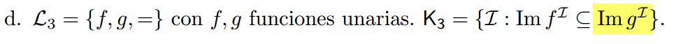

## a)   

Si el conjunto $K_0$ es vacio, entonces ninguna interpretacion pertenece a este, por  
lo tanto, buscamos una formula que sea siempre falsa para cualquier valuacion e interpretacion.  

$\varphi = (\forall x)(x \neq x)$

## b) 

$\varphi = (\forall x)(x = x)$

## c)  
  

$\varphi = (\forall x)(P(x,x)) \land (\forall x)(\forall y)(\forall z)
    (P_{\mathcal{I}}(x,y) \land P_{\mathcal{I}}(y,z) \rarr P_{\mathcal{I}}(x,z))$

## d)  
  

$(\forall y)((\exists x)(f(x)=y) \rarr (\exists z)(g(z) = y))$