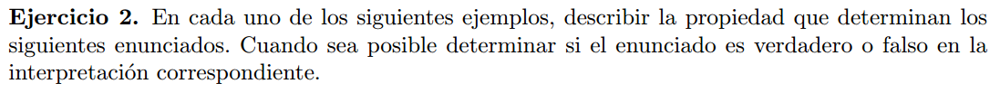
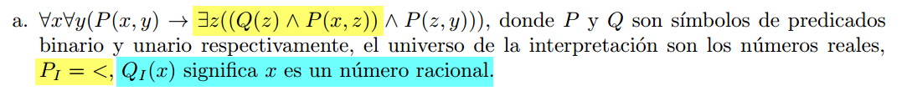
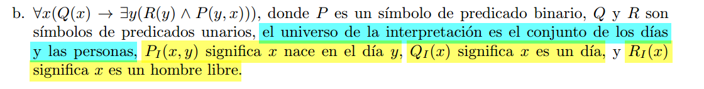
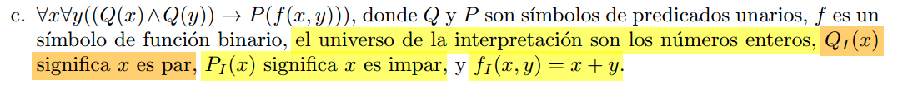

## a)
  

Entre 2 numeros $x, y,$ tal que $x < y$, siempre podemos encontrar un $z \in \mathbb{Q}$
tal que $x < z < y$. Osea expresa el concepto que en los racionales, no hay un sucesor definido.  
Esto es verdadero en los reales, ya que $\mathbb{Q} \subset \mathbb{R}$.

## b)
  

Lo que quiere expresar este enunciado es: Todos los dias nace un hombre libre.

## c)

Si sumamos 2 numeros enteros pares, el resultado es impar.  
Esto es falso para los enteros.
