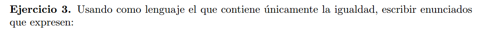

## a) Existen al menos 2 elementos:

$(\exists x) (\exists y) \neg(x = y)$

## b) Existen exactamente 2 elementos

 $\varphi _b = (\exists x) (\exists y) (\neg(x = y) \land (\forall z)(z = x \lor z = y))$

## c) Existen a lo sumo 2 elementos: 

$\varphi_c = ((\exists x)(\forall y) x = y \lor ) \lor \varphi_b $  
La primera parte del OR, expresa que hay un solo elemento.

## Ahora agregamos un simbolo de predicado $P$.

## d) Existen a lo sumo dos elementos y al menos uno que cumplen la propiedad $P$.
$\textcolor{red}{ (\exists x)(\forall y)( x = y \land P(x)) } 
    \lor 
    \textcolor{yellow}{ 
        (\exists x) (\exists y) (\neg(x = y) \land (\forall z)((z = x \lor z = y) \land (P(x) \lor P(y)))) 
    } $   

Escrito de forma mas reducida: 

$(\exists x) (\textcolor{red}{ (\forall y)( x = y \land P(x)) } 
    \lor 
    \textcolor{yellow}{ 
        (\exists y) 
            (\neg(x = y) \land 
                (\forall z)
                    (\ (z = x \lor z = y) 
                        \land (P(x) \lor P(y))\ )\ ) 
        }) $   

Escrito en criollo: Existe un solo elemento y cumple P, o existen exactamente 2 elementos y alguno de ellos cumple P.

## e) Si existe un elemento que cumple la propiedad P, es unico.

$(\forall x)(
    P(x) \rarr 
        \neg(\exists y) (P(y) \land \neg(x = y))
)
$    

En criollo : Si existe un elemento que cumple P, entonces no puede haber otro que cumpla P.

## f) Existe un elemento que cumple la propiedad P y es unico.

$(\exists x)(
    P(x) \land 
        \neg(\exists y) (P(y) \land \neg(x = y))
)
$    

