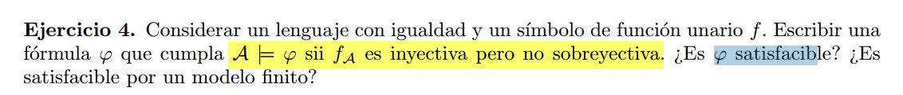

$\varphi = (\forall x)
    (\forall y)
        (f(x) =  f(y) \rarr x = y) \land
(\exists y')
    \neg(\exists x') f(x') = y'
$

Es satisfacible:  
Consideremos la siguiente $\mathcal{L}$-estructura $\mathcal{A}$:

- $A = \mathbb{R}$
- $f(x) = x^2$

Esto vale para cualquier valuacion. Por lo tanto, $\mathcal{A} \vDash \varphi$.

f es inyectiva y sobreyectiva.

Esto no es  satisfacible en un modelo en donde el dominio es finito, ya que
en ese caso una funcion inyectiva unaria tambien deberia ser sobreyectiva (definicion de funcion e inyectividad).