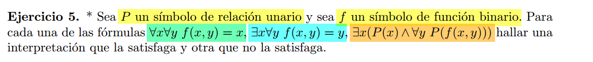

## a)

$\varphi = (\forall x)(\forall y) f(x,y) = x$

Para el caso positivo, propongo la siguiente $\mathcal{L}$-estructura $\mathcal{A}$ en la que $\mathcal{A} \vDash \varphi$.
- $A = \mathbb{N}$ 
- $f_{\mathcal{A}}(x,y) = x$   

Para el caso negativo, propongo la siguiente $\mathcal{L}$-estructura $\mathcal{A}$ en la que $\mathcal{A} \nvDash \varphi$.
- $A = \mathbb{N}$ 
- $f_{\mathcal{A}}(x,y) = 0$   

## b)
$ \varphi = (\exists x)(\forall y) f(x,y) = y$

Para el caso positivo, propongo la siguiente $\mathcal{L}$-estructura $\mathcal{A}$ en la que $\mathcal{A} \vDash \varphi$.
- $A = \mathbb{N}$ 
- $f_{\mathcal{A}}(x,y) = y$   

En este caso, cualquier $x$ cumple, asi que existe $x$.

Para el caso negativo, propongo la siguiente $\mathcal{L}$-estructura $\mathcal{A}$ en la que $\mathcal{A} \nvDash \varphi$.
- $A = \mathbb{N}$ 
- $f_{\mathcal{A}}(x,y) = 0$   

## c)
$ \varphi = (\exists x)(P(x) \land (\forall y)P(f(x,y))) $

Para el caso positivo, propongo la siguiente $\mathcal{L}$-estructura $\mathcal{A}$ en la que $\mathcal{A} \vDash \varphi$.
- $A = \mathbb{N}$ 
- $f_{\mathcal{A}}(x,y) = x$   
- $P_{\mathcal{A}}(x,y)$ sii $x$ es par.

Para el caso negativo, propongo la siguiente $\mathcal{L}$-estructura $\mathcal{A}$ en la que $\mathcal{A} \nvDash \varphi$.
- $A = \mathbb{N}$ 
- $f_{\mathcal{A}}(x,y) = 3$   
- $P_{\mathcal{A}}(x,y)$ sii $x$ es par.