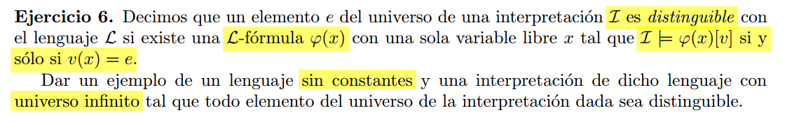

Dado el siguiente lenguaje:  
$\mathcal{L} = \mathcal{C} \cup \mathcal{F} \cup \mathcal{P}$

Donde: 

- $\mathcal{C} = \emptyset$
- $\mathcal{F} = \{s\}$ ($s$ es unario)
- $\mathcal{P} = \{<, =\}$ ($<$ y $=$ binarios)

Y la siguiente $\mathcal{L}$-estructura $\mathcal{A}$ con las interpretaciones:  
- $A = \mathbb{N}$
- $s_{\mathcal{A}}(x) = x+1$ 
- $< \ $ y $\ = \ $ tienen la interpretacion tradicional.

---

Veamos que todos los $n \in \mathbb{N}$ son distinguibles.
Vamos a definir formulas de forma inductiva para distinguir a cualquier natural.  

$\varphi_0(x) =  (\forall y)(y \neq x \rarr x < y)$

Asumo que tengo las formulas $\varphi_0(x), \ldots , \varphi_n(x)$ para distinguir los primeros n numero naturales.
Veamos que siempre es posible definir una formula para distinguir el $n+1$ esimo natural.  

$\varphi_{n+1}(x) =  \neg \varphi_0(x) \land , \ldots , \land \neg \varphi_n(x) 
    \land (\forall y)(\varphi_n(y) \rarr s(y) = x)
$

