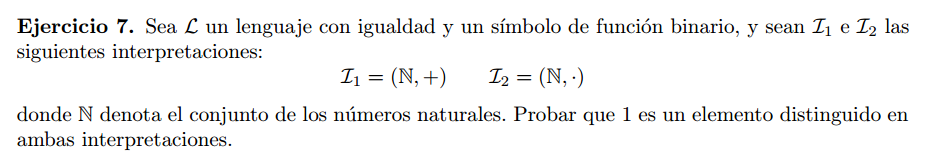

Para $\mathcal{I_1}$:  

Antes que nada definamos una formula para distinguir al 0:  
$\varphi_0(x) =  (\forall y)(y + x = y)$

$\varphi_1(x) = \neg \varphi_0(x) \land (\exists z)(\forall y)
    (\neg\varphi_0(y) \rarr y = z + x)$  

1 es el unico numero tal que cualquier natural n (salvo el 0) puede ser escrito como
n = 1 + z, suponiendo que z no es 0.  
Si $x = k \neq 1$, entonces cualquier numero $n$ menor a $k$ no puede ser escrito como
$n = z + k$.

Para $\mathcal{I_2}$:  

$\varphi(x) = (\forall y)(x . y = y)$

