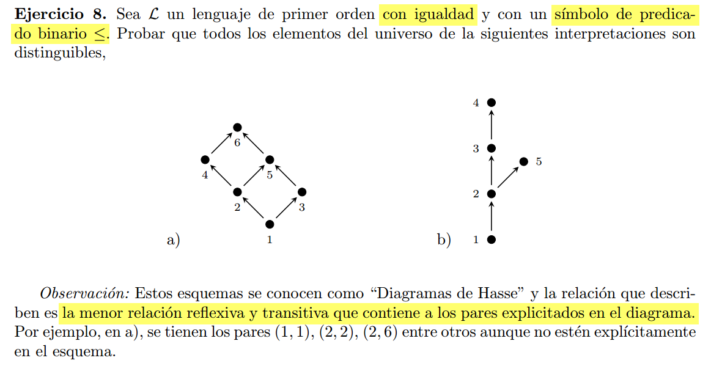

# a)

### 1 : es el menor de todos los elementos  

$ \varphi_1(x)  = (\forall y)(x \leq y) $ 

### 2 : es el unico nodo (aparte del 1) que tiene 2 caminos distintos hacia el maximo elem.  

$ \varphi_2(x) = \neg \varphi_1(x) \land
    (\exists y)(\exists z)(\exists w)(\varphi_6(w) \land 
         \textcolor{red}{
            y\neq w \land y\neq x \land y\neq z \land z \neq w \land x \neq w \land x \neq z
            } \land \textcolor{orange}{x \leq y \land y \leq w}
            \land \textcolor{lightblue}{x \leq z \land x \leq w}) $

En criollo : hay 4 elementos (w,x,y,z), todos distintos (rojo), tal que tenemos las relaciones:  
x -> y -> w (naranja) , x -> z -> w (celeste). Donde w es el elemento maximo y el unico x que cumple es el 2.

### 3 : es el unico nodo (aparte del 2 y el 1) que tiene un camino de long 2 hacia el maximo

$ \varphi_3(x) = \neg \varphi_1(x) \land \neg \varphi_2(x) \land
    (\exists y)(\exists z)(\varphi_6(z) \land 
         \textcolor{red}{
            y\neq z \land y\neq x \land x\neq z 
            } \land \textcolor{orange}{x \leq y \land y \leq z}) $

### 4 : es el unico nodo (aparte del 2) que no se relaciona con el 3

$\varphi_4(x) = \neg \varphi_2(x) \land (\forall y)(\varphi_3(y) \rarr 
    \neg(x \leq y) \land \neg(y \leq x))$

### 5 : (aparte del 6) es el unico nodo para el cual hay 2 caminos desde el nodo 1.

$ \varphi_2(x) = \neg \varphi_6(x) \land
    (\exists y)(\exists z)(\exists w)(\varphi_1(w) \land 
         \textcolor{red}{
            y\neq w \land y\neq x \land y\neq z \land z \neq w \land x \neq w \land x \neq z
            } \land \textcolor{orange}{w \leq y \land y \leq x}
            \land \textcolor{lightblue}{w \leq z \land z \leq x}) $

### 6 : el maximo de todos los elementos.

$ \varphi_6(x)  = (\forall y)(y \leq x) $ 

<!-- todas las relaciones explicitas en a)

(1,1) (1,2) (1,3) (1,4) (1,5) (1,6) 
(2,2) (2,4) (2,5) (2,6)  
(3,3) (3,5) (3,6)  
(4,4) (4,6)  
(5,5) (5,6)  
(6,6)   -->

# b)

### 1 : es el menor de todos los elementos  

$ \varphi_1(x)  = (\forall y)(x \leq y) $

### 5 : es el unico elemento que no es menor igual al elem 4.

$\varphi_5(x) = (\forall y)(\varphi_4(y) \rarr \neg(x \leq y))$

### 3 : Es el unico elemento (aparte del 5) con un camino de long 2 desde el minimo (1).

$ \varphi_3(x) = \neg \varphi_5(x) \land 
    (\exists y)(\exists z)(\varphi_1(z) \land 
         \textcolor{red}{
            z\neq y \land y\neq x \land x\neq z 
            } \land \textcolor{orange}{z \leq y \land y \leq x}) $

### 4 : es el unico elemento que tiene un camino de long 3 desde el minimo (1).

$ \varphi_4(x) = (\exists y)(\exists z)(\exists w)(\varphi_1(w) \land 
         \textcolor{red}{
            y\neq w \land y\neq x \land y\neq z \land z \neq w \land x \neq w \land x \neq z
            } \land \textcolor{orange}{w \leq y \land y \leq z \land z \leq x}) $

### 2 : No es ninguno de los otros (1,3,4,5)

$\varphi_2 = \neg \varphi_1(x) \land \neg \varphi_3(x) \land \neg \varphi_4(x)  \land \neg \varphi_5(x)$

