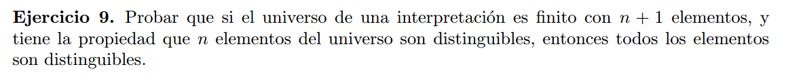

Sea $\varphi_i(x)$ la formula que distingue el i-esimo elemento del universo (i : 1 , ... ,  n).  
Para distinguir al $n+1$ esimo elemento propongo la siguiente formula:   
$\varphi_{n+1}(x) = \neg \varphi_1(x) \land , \  \ldots \  , \land \neg \varphi_n(x)$