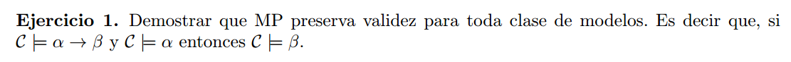

"Si $\ \mathcal{C} \vDash \alpha \rarr \beta \ $ y $\ \mathcal{C} \vDash \alpha \ $ entonces $\ \mathcal{C} \vDash \beta \ $ "

Es lo mismo que decir:  

"Para todo $ \ \mathcal{M} \in \mathcal{C} \ $ :  si $\ \mathcal{M} \vDash \alpha \rarr \beta\ $ y $\ \mathcal{M} \vDash \alpha \ $ entonces $\ \mathcal{M} \vDash \beta\ $"

Probemos esto ultimo:

Sabemos que $\mathcal{M} \vDash \varphi \ $ si $\mathcal{M} \vDash \varphi [v]\ $ para toda valuacion $v$.

Sean $v$ y $\mathcal{M} \in \mathcal{C}$ una valuacion y un modelo cualesquiera, supongamos que
$\mathcal{M} \vDash \alpha \rarr \beta [v]\ $, por la definicion de valuacion, esto pasa sii  $\mathcal{M} \nvDash \alpha[v]\ $ o $\ \mathcal{M} \vDash \beta [v]\ $.
Supongamos que tambien se cumple $\mathcal{M} \vDash \alpha[v]$, entonces para que se cumpla lo primero que dijimos, necesariamente debe cumplirse que $\mathcal{M} \vDash \beta[v]$. 

Y como usamos $v$ y $\mathcal{M}$ genericos, esto ultimo vale para todos $v$ y $\mathcal{M}$. Listo probamos lo que queriamos.
