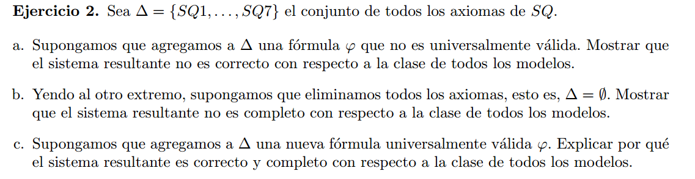
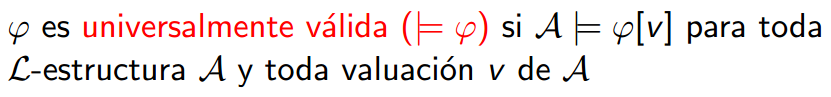

## a)

Sea $\Delta' = \Delta \cup \varphi$.  
Sea $\mathcal{C}$ la clase de todos los modelos, que $\Delta'$ no sea correcto con respecto a $\mathcal{C}$ equivale a decir que:  
Existe una formula $\alpha$ tal que $\Delta' \vdash \alpha$ , pero 
$\mathcal{C} \nvDash \alpha$

Que $\varphi$ no sea universalmente valida quiere decir que existe una estructura $\mathcal{M}$ y una valuacion $v$ para las cuales no vale $\mathcal{M} \nvDash \varphi[v]$.

Dado que $\varphi \in \Delta'$, vale $\Delta' \vdash \varphi$. Pero $\mathcal{C} \nvDash \varphi$ como consecuencia de que $\varphi$ no es universalmente valida.  

Por lo tanto $\Delta'$ no es correcto con respecto a la clase $\mathcal{C}$.

## b)  

Supongamos que es cierto, que si es completo:  
$\mathcal{C} \vDash \varphi \Rarr \   \vdash_{\Delta} \varphi$.

Sabemos que $SQ$ es completo y correcto con respecto a C, entonces vale $\mathcal{C} \vDash SQ1$, pero $\ \nvdash_{  \Delta} SQ1$, ya que no esta en $\Delta$ (nuestro sistema axiomatico vacio).
Absurdo!

## c)  

Sea $\Delta' = \Delta \cup \varphi$, con $\varphi$ universalmente valida.  

### completitud :
Sea $\alpha$ una formula cualquiera.

Si $\mathcal{C} \vDash \alpha$ , dado que $\Delta$ = $SQ$ y sabemos que $SQ$ es correcto y completo con respecto a $\mathcal{C}$, val que $\Delta \vdash \alpha$. Si podemos deducir $\alpha$ a partir de $\Delta$, seguro que lo podemos dedudir a partir de $\Delta'$, entonces vale que $\Delta' \vdash \alpha$.
Logramos demostrar que: $\mathcal{C} \vDash \alpha \ \Rarr \Delta' \vdash \alpha$.  
Por lo tanto $\Delta'$ es correcto con respecto a $\mathcal{C}$.

### correctitud :

Como $\varphi$ es universalmente valida, vale que para toda estructura (modelo) $\mathcal{A}$ de un lenguaje, $\mathcal{A} \vDash \varphi$; lo que es equivalente a decir $\mathcal{C} \vDash \varphi$, ya que $\mathcal{C}$ es la clase de todos los modelos.

Sup $(\Delta' = \Delta \cup \varphi )\vdash \alpha$ , quiero ver que $\mathcal{C} \vDash \alpha$.

Como $\mathcal{C} \vDash \varphi$ y $\Delta$ es completo con respecto a $\mathcal{C}$, entonces $\Delta \vdash \varphi$.  
Entonces $\varphi$ no aporta nada a la demostracion de $\alpha$ (se puede reemplazar $\varphi$ con su demo con $\Delta$). Por lo tanto nos queda  
$\Delta \vdash \alpha$, y como $\Delta$ ($SQ$) es correcto con respecto a $\mathcal{C}$, entonces $\mathcal{C} \vDash \alpha$.

